# HotelHub: Hotel Management System
[](LICENSE)

HotelHub is a comprehensive hotel management system developed using Django, a high-level Python web framework. This system is designed to streamline and automate various aspects of hotel operations, providing a centralized platform for efficient management.

## Features

- **User Authentication:** Secure user authentication and authorization system to ensure that only authorized personnel can access and manage the system.

- **Room Management:** Easily manage and track the status of rooms, including availability, occupancy, and maintenance.

- **Check-In/Check-Out:** Streamline the check-in and check-out processes for guests, ensuring a smooth experience.

- **Multi-Platform Support:** Responsive design for seamless use on various devices, including desktops, tablets, and smartphones.

## Screenshots

| Screenshot Name          | Image |
|--------------------------|-------|
| create_guest.png         | 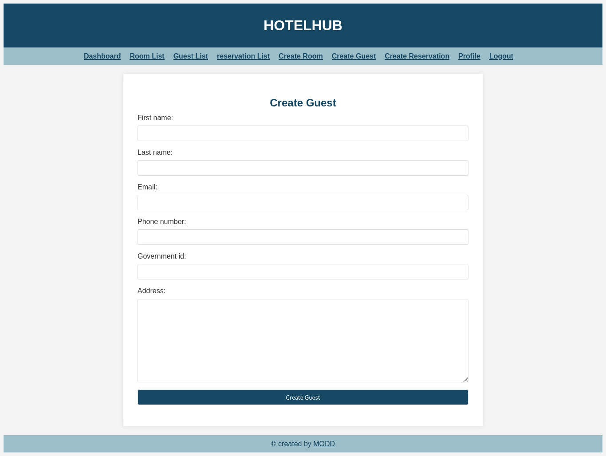 |
| guest_details.png        | 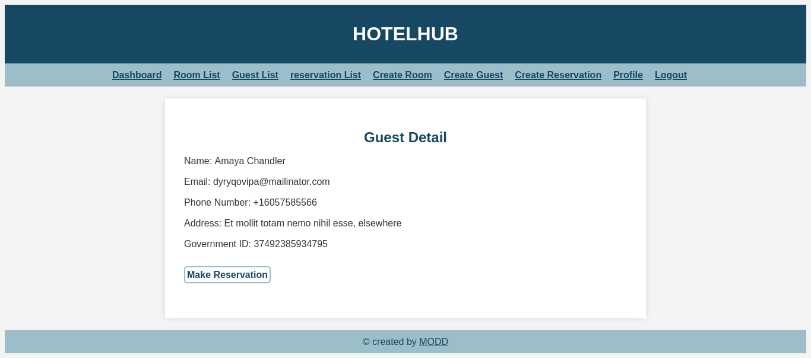 |
| profile.png              | 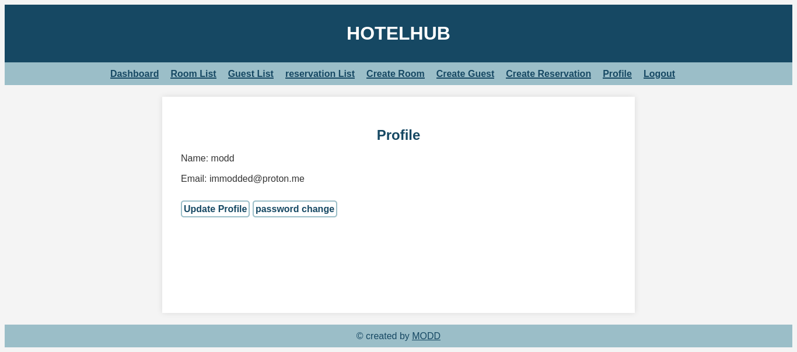 |
| room_details.png         | 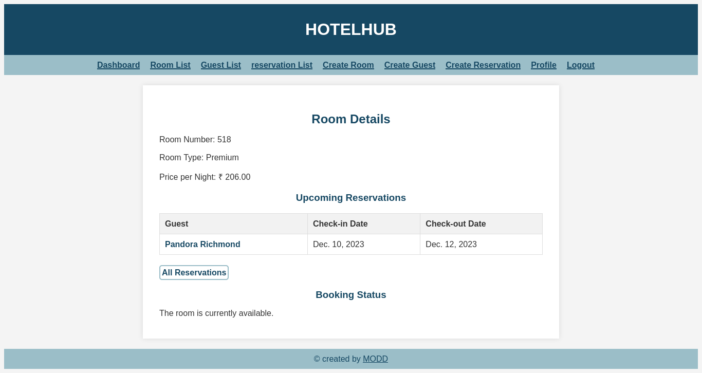 |
| create_reservation.png   | 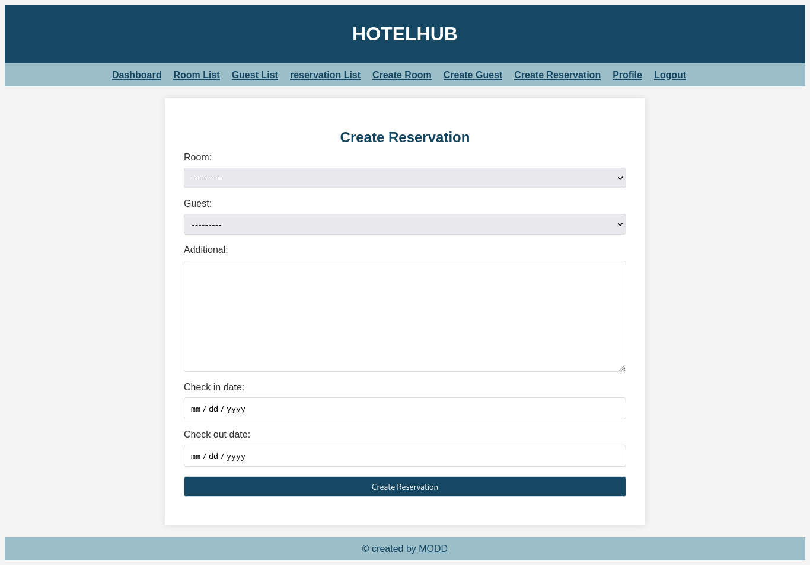 |
| guest_list.png           | 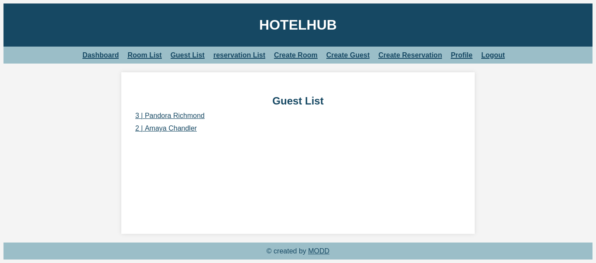 |
| profile_update.png       | 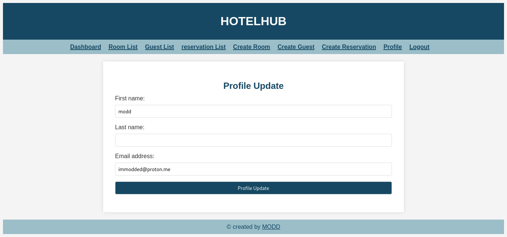 |
| room_list.png            | 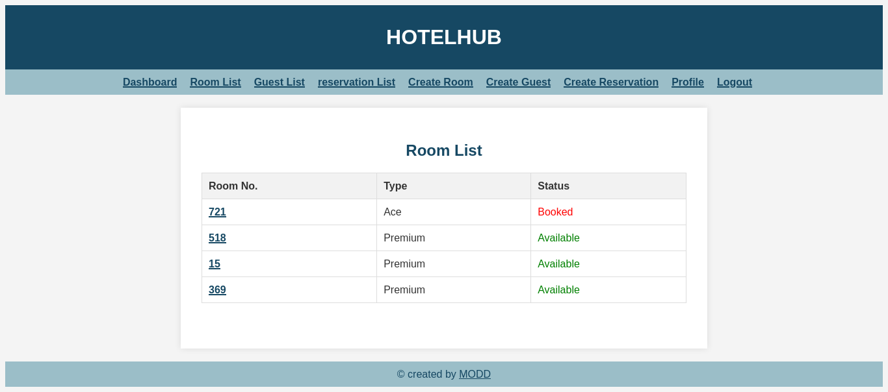 |
| create_room.png          | 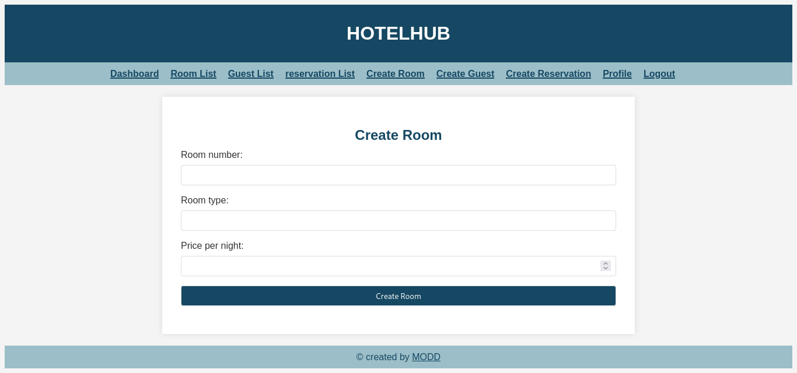 |
| login.png                | 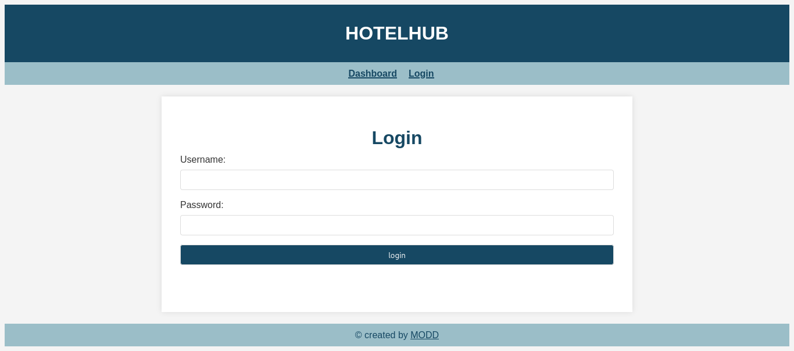 |
| reservation_details.png  | 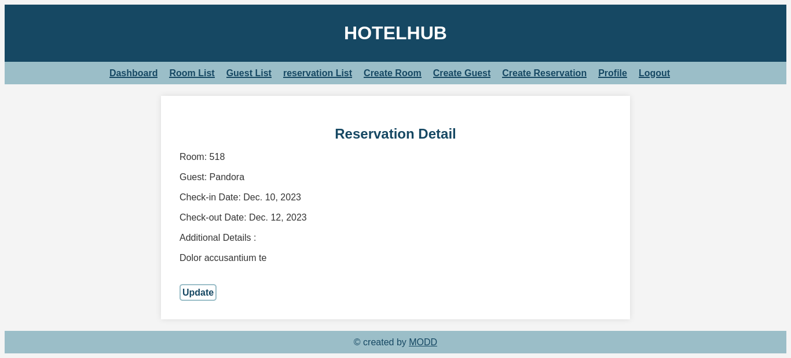 |
| room_reservations.png    | 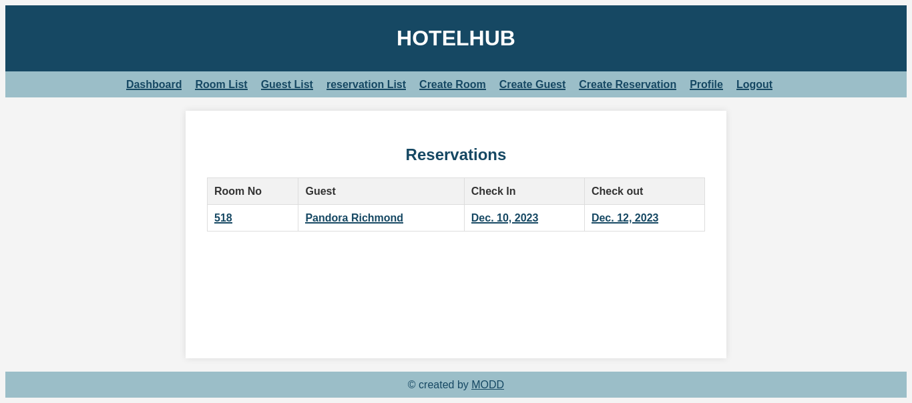 |
| dashboard.png            | 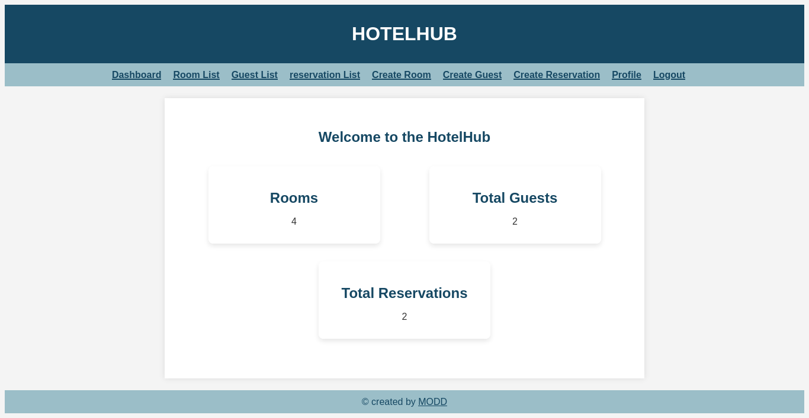 |
| password_change.png      | 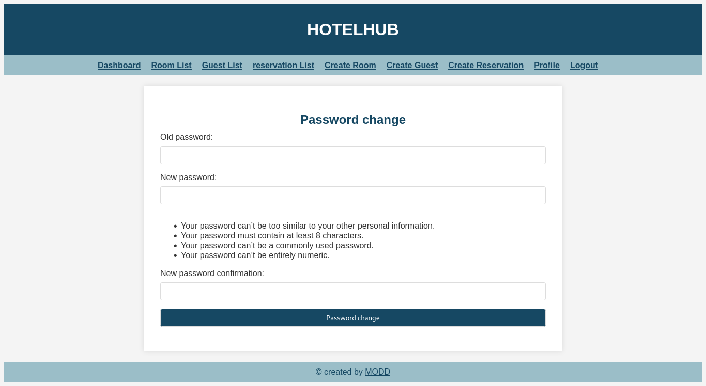 |
| reservations_all.png     | 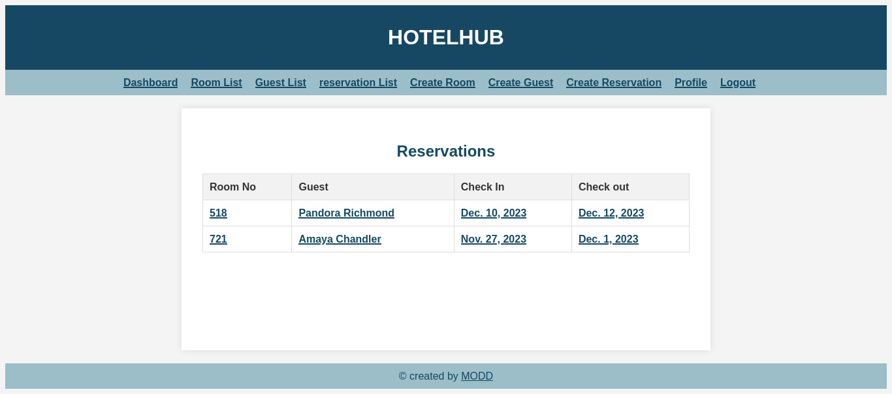 |
| update_reservation.png   | 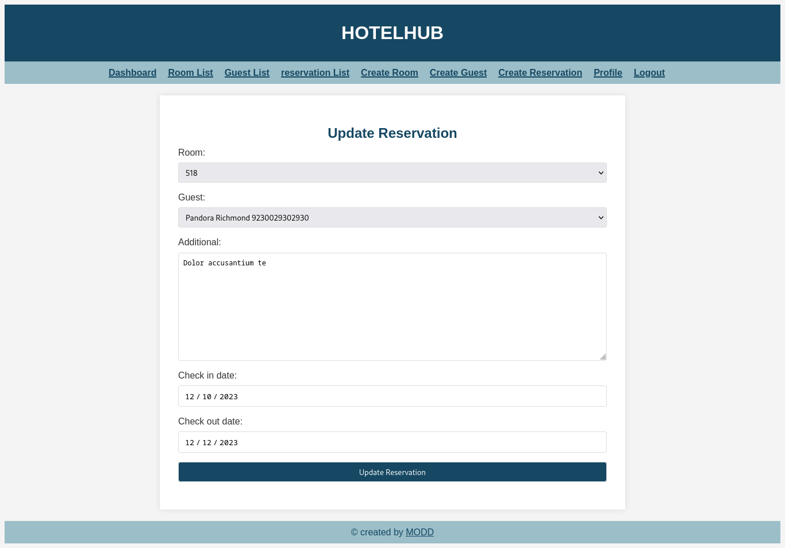 |


## Installation

1. Clone the repository:

   ```bash
   git clone https://github.com/immodded/hotelhub.git
   ```
2. setup:
   ```
   python manage.py makemigrations
   python manage.py migrate
   python manage.py runserver 0.0.0.0:8000
   ```
## Configuration
   - Update the database settings in hotelhub/settings.py to use your preferred database.
   - Customize the application settings in hotelhub/settings.py as needed.

## Issues

Found a bug? Report it on [GitHub Issues](https://github.com/immodded/hotelhub/issues).

## License

This project is licensed under the [Custom Restrictive License](LICENSE).
